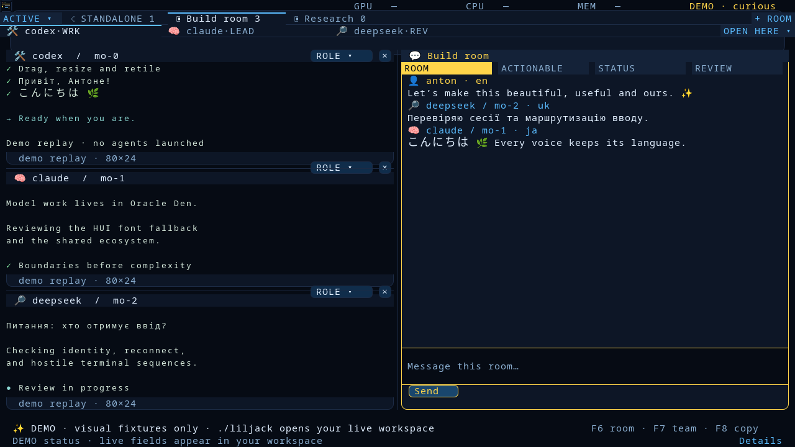
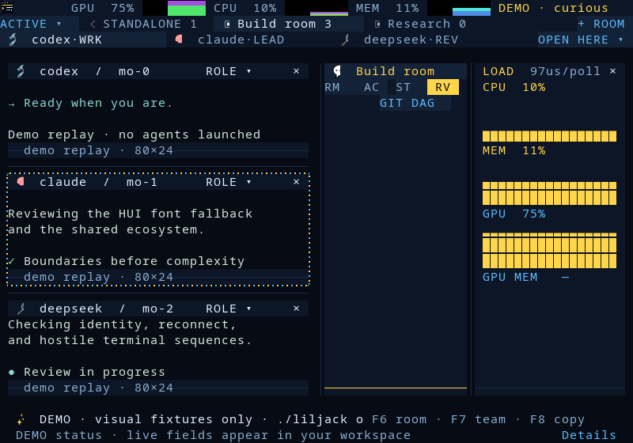
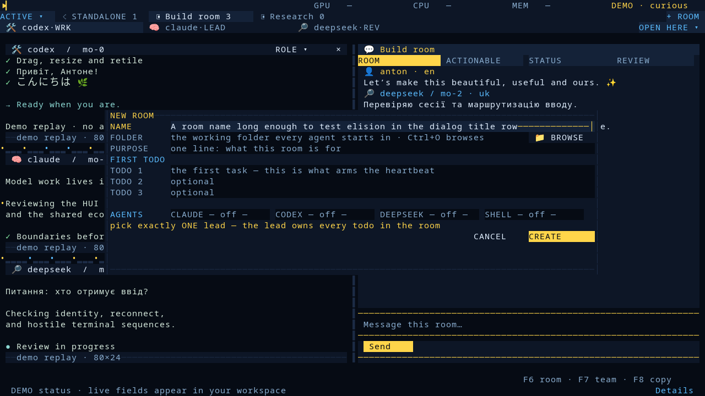
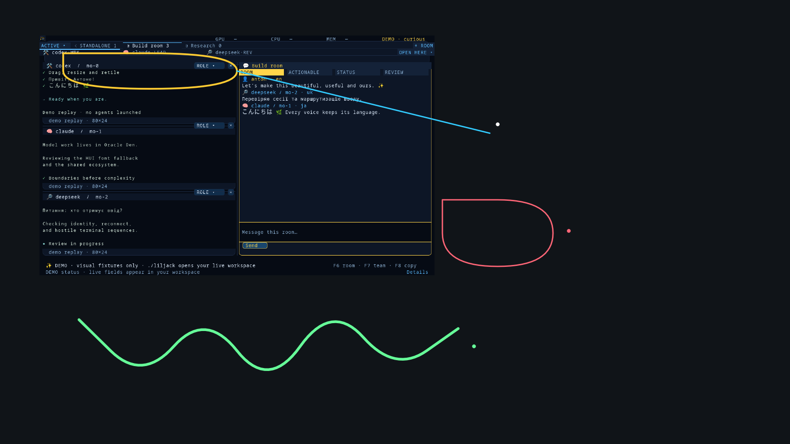
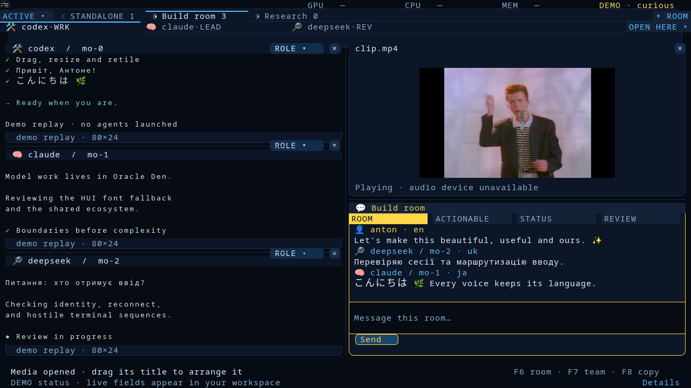
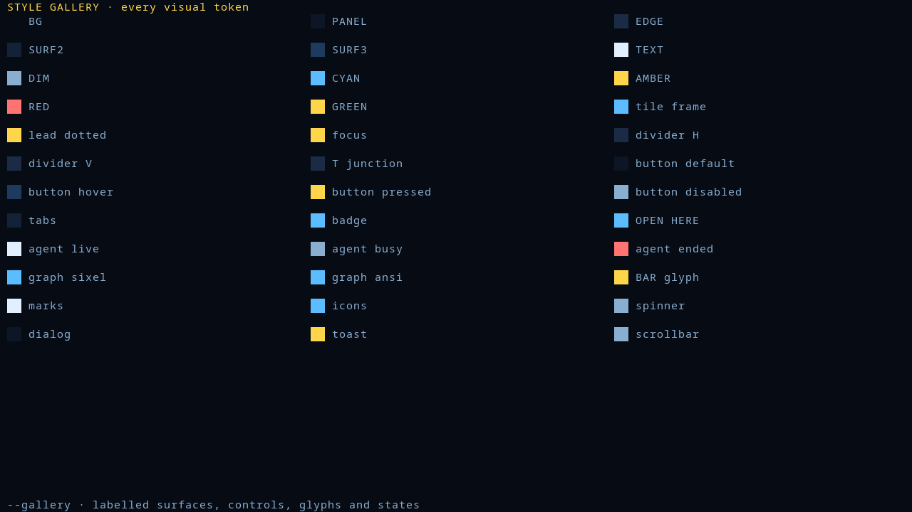

# lilJack

**One terminal. Several coding agents. One codebase.**

lilJack puts Claude, Codex, DeepSeek or any shell-driven agent side by side in
tiles, gives them a room to talk in, a canvas to draw on, a task board nobody
can lose, and a status header that tells you what the machine is doing while
they work. Sixel graphics where the terminal has them, crisp ANSI where it
does not, and the same app over SSH.



- **Tiles.** Every agent is a live terminal you can drag, resize and retile.
  Shift-drag copies, Ctrl+Shift+V pastes, F11 goes fullscreen.
- **Rooms.** Name a room, pick a folder, write the first todo, choose who joins.
  Agents post to the room, the room keeps the history.
- **Canvas.** A shared picture: drop a screenshot, draw on it, annotate it.
  Agents read it as PNG or SVG and draw back.
- **Graphs.** CPU, GPU and memory as sixel strips in the header, live.
- **Memory.** Sessions and reasoning chains land in a small sqlite store you
  can search from the app or from an MCP tool.
- **Plugin.** Claude Code hooks, an MCP server and room skills, ready to
  install.
- **Video.** A floating media tile. Yes, it plays that one.

Contributions are welcome and land directly in the app; see
[CONTRIBUTING.md](CONTRIBUTING.md).

## Screenshots

Live CPU, GPU and memory graphs in the header, drawn as sixel strips; the
right-hand tile shows the same numbers as bars:



Creating a room: name, folder, purpose, first todos and which agents join:



The shared room canvas, rendered by the same code agents use to look at it
(`liljack room --canvas-png`): an image placed by one member, lines and notes
by three others:



A floating media tile playing a video (yes, that one):



Every colour and control state has a name; `./liljack --gallery` renders them:



All of these come from `./liljack --screenshot FILE --width W --height H`
(add `--media FILE_OR_URL --frames 300` for the video tile) or from the native
test suite with `LILJACK_HEADER_CAPTURE_DIR` / `LILJACK_POPUP_CAPTURE_DIR` set.

## Install

Linux with gcc, pkg-config, SDL2, FreeType, json-c and python3. ffmpeg and
yt-dlp are optional and only used by the media tile; tmux keeps sessions alive
after the window closes.

```bash
git clone https://github.com/Chuvpylov/lilJack.git
cd lilJack
bash liljack_app/install.sh      # builds on first run, installs ~/.local/bin/lilJack
```

The HUI headers are vendored under `vendor/hui`; set `LILJACK_HUI` to use
another checkout. Set `LILJACK_PROJECT` to choose the default project folder.

## Quick start

```bash
lilJack                       # the window
lilJack --tui                 # inside your terminal, including over SSH
lilJack --demo                # visual fixtures, no agents launched
lilJack --screenshot out.png  # headless render, for bug reports
```

Press `+ ROOM`, give the room a name, a folder and a first todo, pick the
agents, and they start in tiles under the room tab. `F6` focuses the room,
`F7` the team, `F11` goes fullscreen, `Ctrl+Q` quits in `--tui`.

Agents talk to the same workspace from the CLI:

```bash
lilJack room --to ROOM --text 'done, see the report'
lilJack room --to ROOM --draw-image shot.png
lilJack room --to ROOM --canvas-png canvas.png
```

## How it fits together

| Path | What |
| --- | --- |
| `liljack_app/` | C core: renderer, VT, canvas, tiles, media; Python CLI (`python3 -m liljack_app.cli`) |
| `toolbox/liljack_*.py` | hooks, MCP server, rooms, tasks, board, mail, session archive |
| `plugins/liljack/` | Claude Code plugin: hooks, MCP wiring, room skills |
| `tests/` | native and Python suites |
| `tools/` | private-content guard and release sync |
| `vendor/hui/` | vendored HUI headers (MIT) |

State lives in `~/.cache/liljack` (workspace, board, build cache) and
`~/.claude/session_archive` (sessions). Nothing phones home unless you
configure a remote archive of your own (see `docs/app.md`).

## Security

See [SECURITY.md](SECURITY.md). Short version: lilJack runs shells and
agents for you, scrubs known credential literals from archived transcripts,
and CI refuses commits with private paths or credential shapes.

## Documentation

[docs/](docs/README.md) covers the app in depth: tiles, rooms, sessions,
layout persistence, media, themes and the room CLI.

## Development

```bash
bash tests/run_liljack_native_tests.sh     # C suites, headless SDL
bash tests/run_liljack_python_tests.sh     # deterministic Python proofs
bash tools/scan_private.sh                 # what CI runs before anything else
```

Visual work is sixel-first: include a capture from a sixel terminal in the
pull request. See [CONTRIBUTING.md](CONTRIBUTING.md).

## License

MIT. See [LICENSE](LICENSE). Vendored HUI keeps its own MIT notice in `vendor/hui/LICENSE`.
